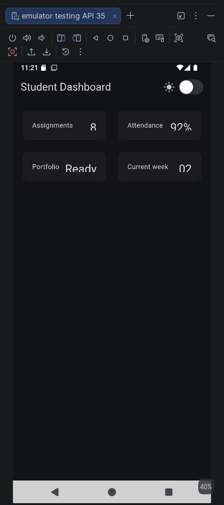
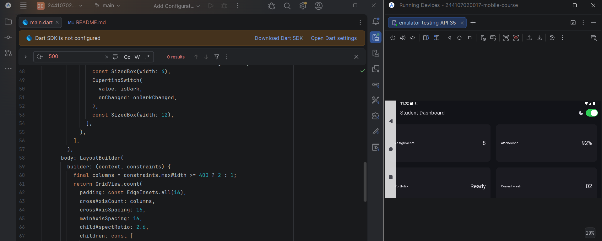
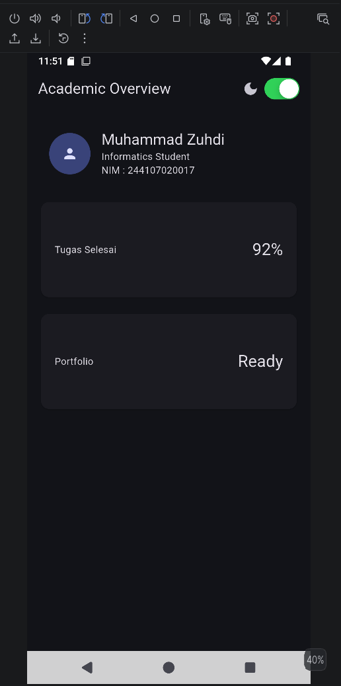

# _02_week_2_responsive_dashboard

Nama : Muhammad Zuhdi Yudadharma 
NIM  : 244107020017 
Kelas: TI-3H 

1. hasil awal student dashboard 

2. hasil setelah menambahkan  
_02_week_2_responsive_dashboard/screenshots/darkmode.png

Eksperimen  
1. Ubah breakpoint dari 700 menjadi nilai lain dan amati perubahan jumlah kolom. 
final columns = constraints.maxWidth >= 400 ? 2 : 1; = menghasilkan colum menjadi kecil 

2. Ubah themeMode menjadi ThemeMode.dark, lalu kembalikan ke ThemeMode.system. = menghasilkan tampilan akan dark mode terus meskipun CupertinoSwitch mati 

3. Uji aplikasi dengan ukuran layar emulator yang berbeda. 

AI PROMPT 
| Aspek                | `GridView`                                                             | `LayoutBuilder + Column`                                                                    
| **Tujuan utama**  : Menampilkan banyak item dalam bentuk grid                              : Mengatur elemen secara vertikal dan menyesuaikan layout berdasarkan ukuran layar               
| **Responsif**     : Sangat cocok untuk kartu yang jumlahnya banyak                         : Lebih fleksibel untuk dashboard yang memiliki header, profil, statistik, dan section berbeda   
| **Layar sempit**  : Bisa dibuat 1 kolom dengan `crossAxisCount`                            : Bisa mengubah susunan elemen berdasarkan `constraints.maxWidth`                                
| **Layar lebar**   : Mudah dibuat 2–3 kolom                                                 : Lebih mudah mengatur kombinasi `Row`, `Column`, dan `Expanded`                                 
| **Header profil** :Kurang natural jika seluruh konten dibuat sebagai grid                  : Lebih natural karena header bisa ditempatkan di atas grid                                      
| **Aksesibilitas** : Tidak otomatis lebih buruk, tetapi urutan pembacaan perlu diperhatikan : Lebih mudah mengatur urutan informasi secara logis                                             
| **Kompleksitas**  : Relatif sederhana untuk kumpulan card                                  : Lebih kompleks karena membutuhkan pengaturan layout                                            
| **Cocok untuk**   : Dashboard berbasis kartu/statistik                                     : Dashboard akademik dengan header + beberapa bagian informasi                                   

- Tugas
1. Hasil  

2. testing dasar 

