# week3_navigation

Nama : Muhammad Zuhdi Yudadharma 
NIM  : 244107020017 
Kelas: TI-3H 

1. Hasil Aplikasi multi-page dengan GoRouter 
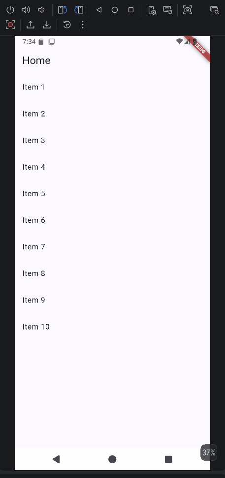

2. Hasil Aplikasi ToDo dengan Riverpod dan crud nya 
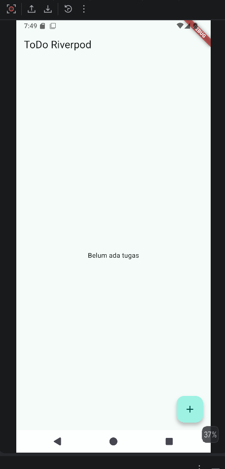
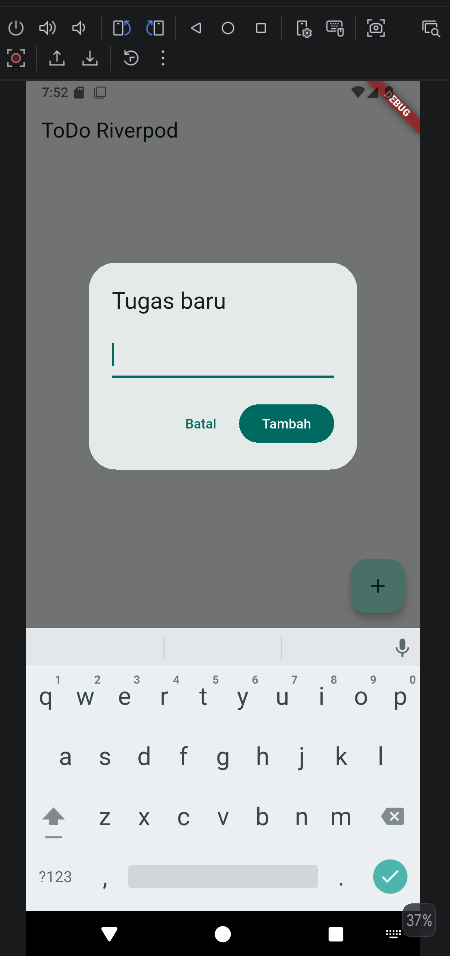
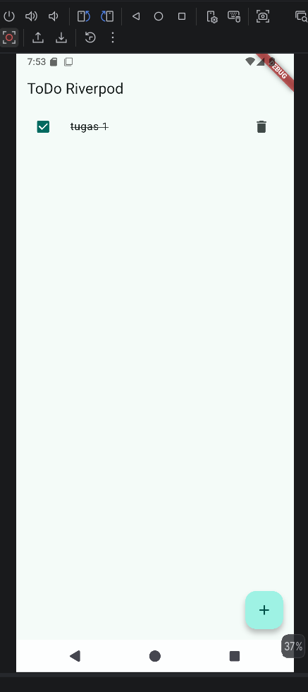

3. Hasil AsyncValue: loading, error, success, Uji ketiga state 
   - Salin kode di atas ke project ToDo Anda (atau project terpisah) dan jalankan : 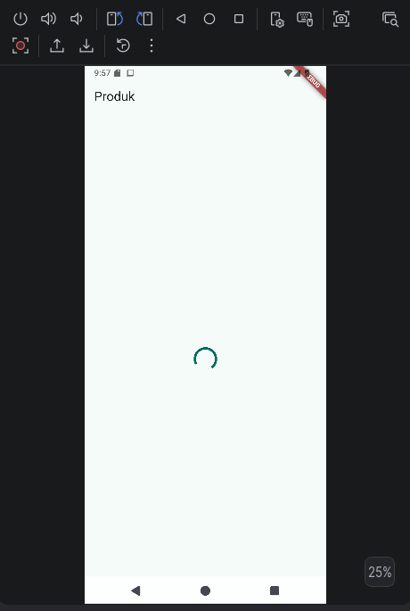 
   - Ubah build() : throw Exception('Gagal terhubung ke server'); : 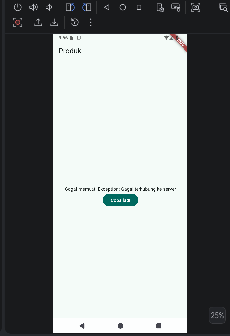 
   - Pulihkan kode, pastikan state success tampil : 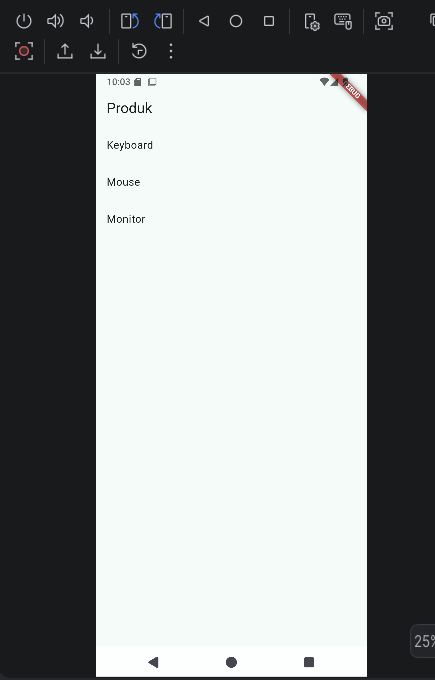 
   - refleksi : Stale data lebih baik karena pengguna tetap dapat melihat data sebelumnya saat proses refresh berlangsung, sehingga aplikasi terasa lebih responsif dan tidak membingungkan. Pola ini penting pada aplikasi yang sering melakukan pembaruan data seperti berita, e-commerce, dashboard, dan media sosial.

4.  AI Challenge 
AI yang digunakan Chat GPT berikut untuk hasil promp nya 
- stats_page.dart 
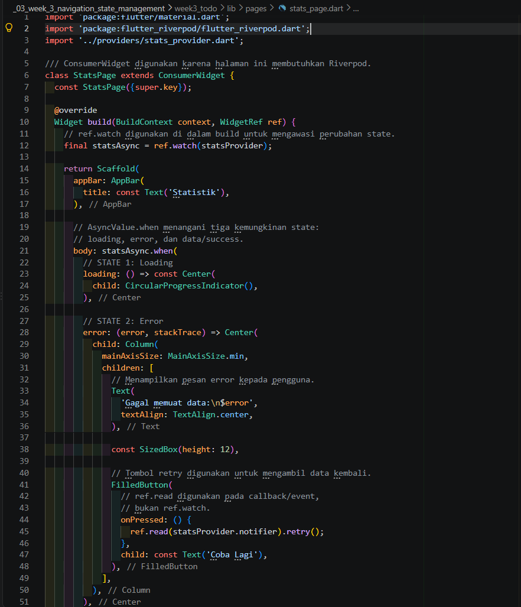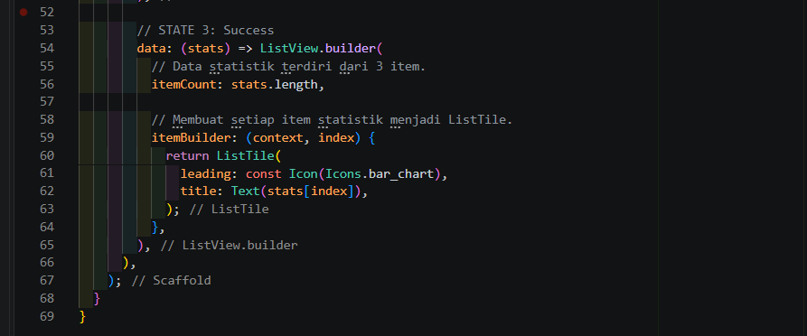 
- stats_provide.dart 
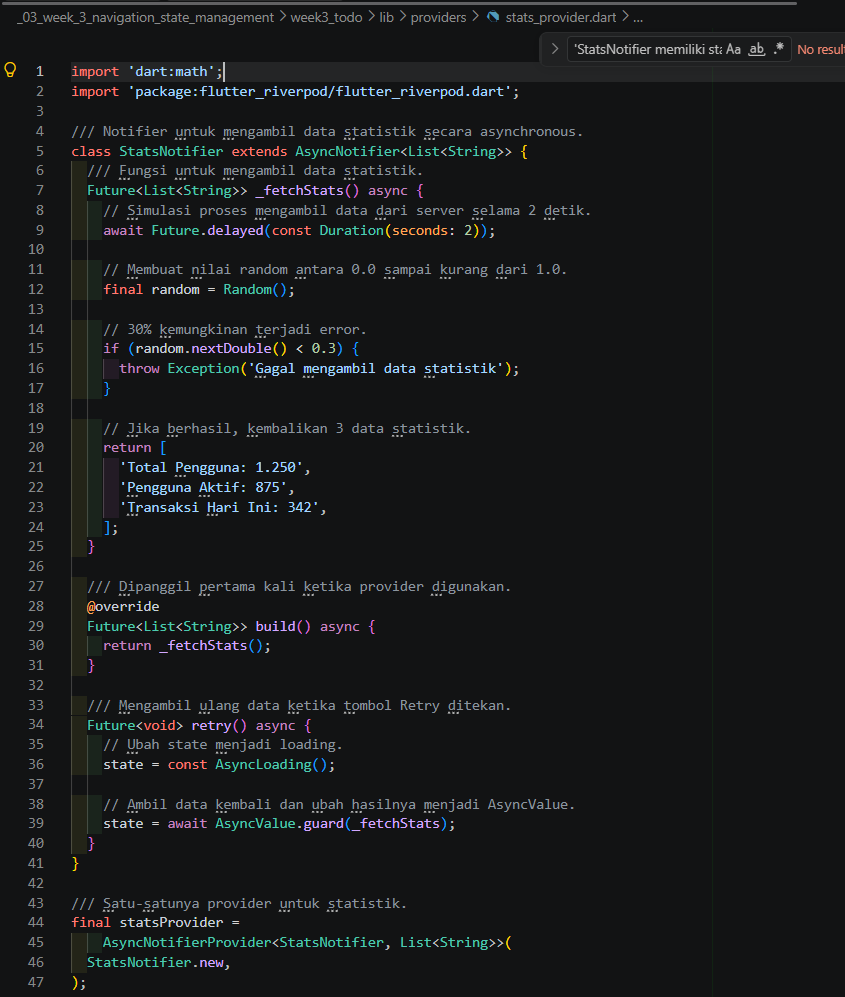 
- stats_provider_test 
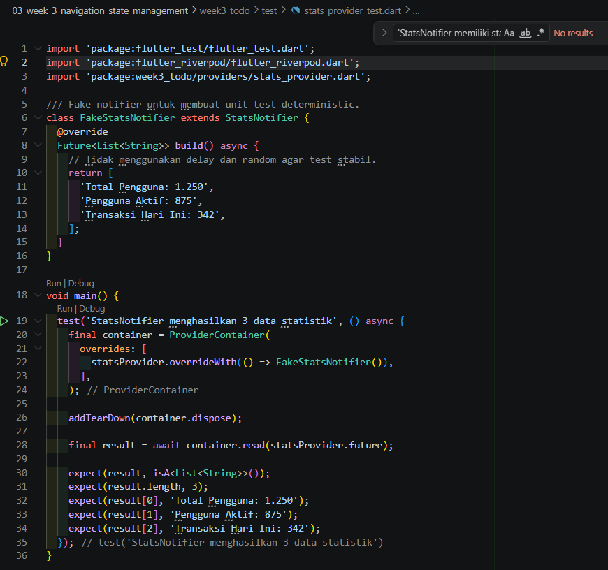 
- widget_test.dart 
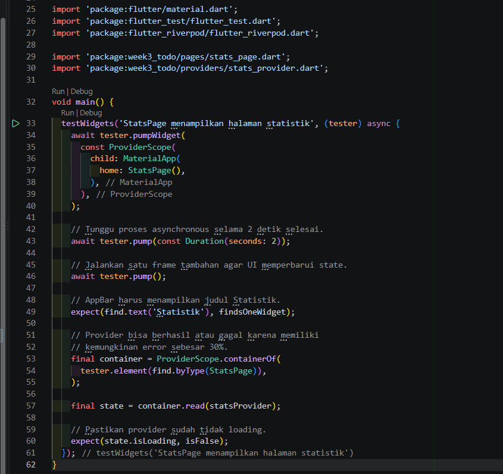
- main.dart 
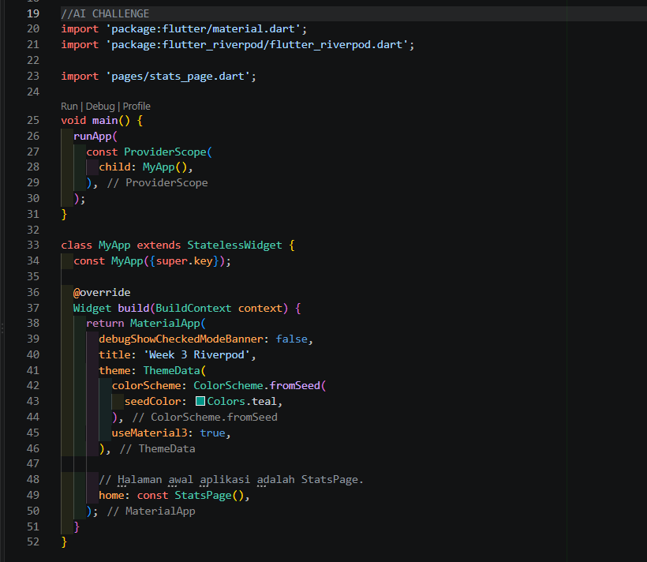 
- hasil tampilan 
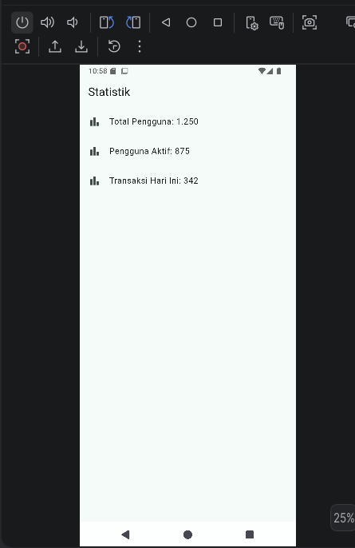 
-hasil testing 
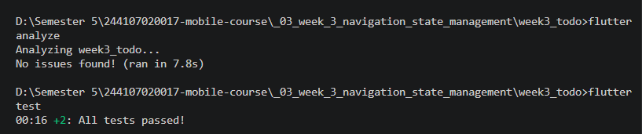

## AI Verification Checklist

| No. | Pemeriksaan | Hasil | Temuan / Penjelasan |
|---|---|---|---|
| 1 | State diubah secara immutable | LULUS | State tidak dimutasi secara langsung. Tidak terdapat `state.add()`, `state.remove()`, atau mutasi list secara langsung. Perubahan state menggunakan assignment seperti `state = const AsyncLoading()` dan hasil `AsyncValue.guard()`. |
| 2 | `ref.watch` hanya di `build` dan `ref.read` di callback | LULUS | `ref.watch(statsProvider)` digunakan di dalam `build()` untuk mengamati perubahan state. `ref.read(statsProvider.notifier).retry()` digunakan pada callback tombol Retry. |
| 3 | Ketiga state `AsyncValue` ditangani | LULUS | `statsAsync.when()` menangani tiga kondisi: `loading` dengan `CircularProgressIndicator`, `error` dengan pesan error dan tombol Retry, serta `data` dengan `ListView` berisi data statistik. |
| 4 | Provider eksplisit dan tidak duplikat | LULUS | Provider dideklarasikan secara eksplisit sebagai `AsyncNotifierProvider<StatsNotifier, List<String>>` dengan nama `statsProvider`. Hanya terdapat satu provider untuk data statistik. |
| 5 | Tidak menggunakan API Riverpod lama | LULUS | Implementasi menggunakan `AsyncNotifier`, `AsyncNotifierProvider`, dan `ConsumerWidget`. Tidak menggunakan `StateProvider` atau `StateNotifierProvider` lama. |
| 6 | `flutter analyze` dan `flutter test` | LULUS SETELAH PERBAIKAN | `flutter analyze` telah diperbaiki dari warning `avoid_relative_lib_imports` dengan menggunakan package import. `flutter test` sebelumnya mengalami error timer pending karena test tidak menunggu delay asynchronous 2 detik. Test kemudian diperbaiki agar menunggu proses asynchronous selesai. |

5. Refactoring dan Testing
- todo_tile.dart 
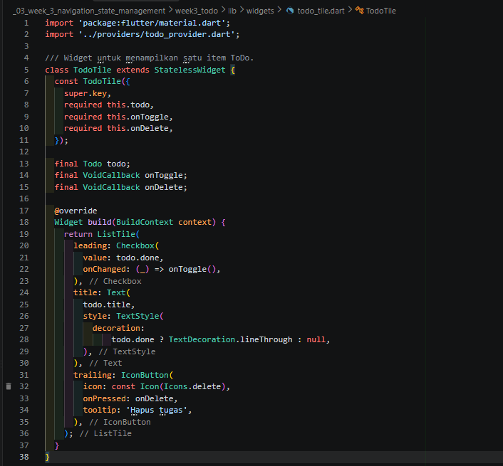 
- ubah todo_provider.dart 
 
- Refactor TodoPage 

 
- Integrasi GoRouter 
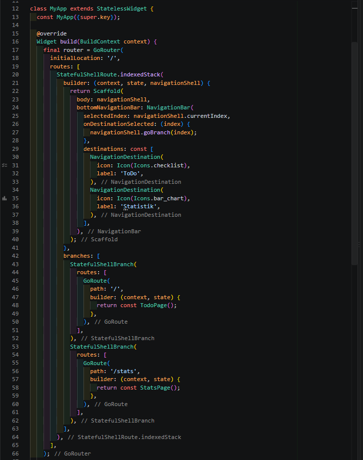
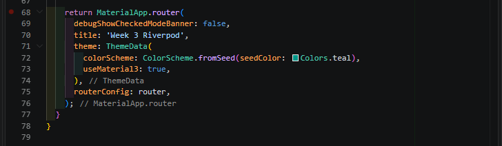 
- dokumentasi docs/ai_verification.md 
[text](week3_todo/doc/ai_verification.md) 
- Jalankan verifikasi 
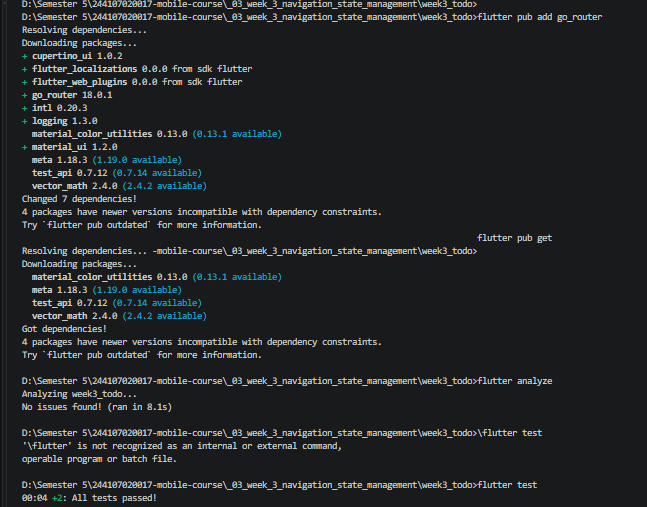 
- Hasil 

## Refleksi
1. Kapan setState masih cukup, dan kapan state harus naik ke Riverpod? 
setState cukup untuk state sederhana dalam satu widget. Riverpod lebih cocok jika state digunakan banyak widget/halaman atau memiliki logika yang kompleks.
2. Apa perbedaan context.go dan context.push, dan kapan masing-masing tepat digunakan? 
context.go untuk berpindah langsung ke route tertentu, context.push untuk membuka halaman baru dan tetap menyimpan halaman sebelumnya di stack.
3. Bagaimana AsyncValue mencegah bug dibanding tiga boolean terpisah? 
AsyncValue mengatur kondisi loading, data, dan error di state jadi lebih aman dan mengurangi state yang salah.
4. Bagian mana dari hasil AI yang Anda perbaiki, dan mengapa? 
memperbaiki struktur kode, memisahkan TodoTile, membuat derived provider, memperbaiki retry() pada StatsNotifier, dan membuat testing mudah dites.