# Week 4: Networking & REST API

Project Flutter untuk mempelajari konsumsi REST API menggunakan Dio, state
management dengan Riverpod, pagination, error handling, dan testing tanpa
request internet.

## Identitas

| Keterangan | Detail |
| --- | --- |
| Nama | Muhammad Zuhdi Yudadharma |
| NIM | 244107020017 |
| Kelas | TI-3H |

## Teknologi

- Flutter
- Dio
- Flutter Riverpod
- GoRouter
- JSONPlaceholder API

## Daftar Isi

- [Praktikum 1: Dio dan Model Data](#praktikum-1-dio-dan-model-data)
- [Praktikum 2: Provider dan Error Handling](#praktikum-2-provider-dan-error-handling)
- [Praktikum 3: Pagination](#praktikum-3-pagination)
- [AI Challenge](#ai-challenge)
- [Refactoring dan Testing](#refactoring-dan-testing)
- [Menjalankan Project](#menjalankan-project)

## Praktikum 1: Dio dan Model Data

### Model `Post`

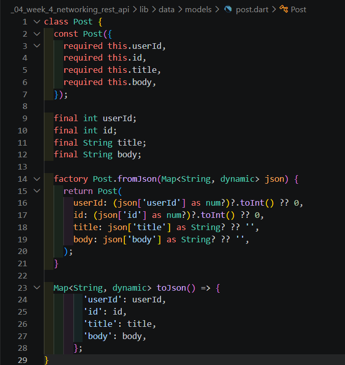

### API Client

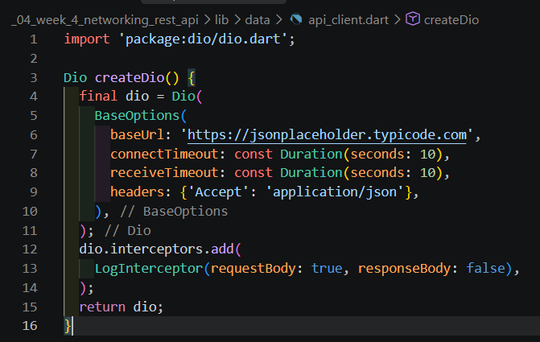

### Post Repository

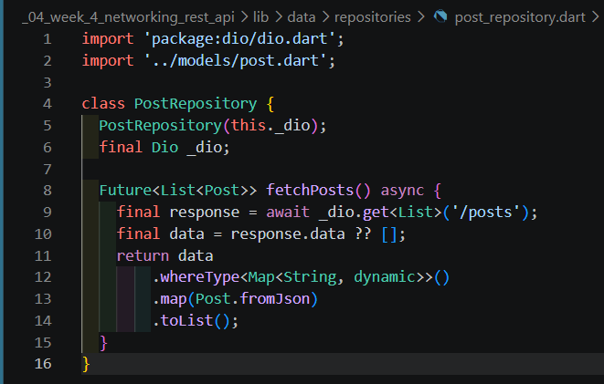

## Praktikum 2: Provider dan Error Handling

### Kondisi normal

Aplikasi menampilkan loading kemudian daftar 100 post ketika koneksi internet
tersedia.

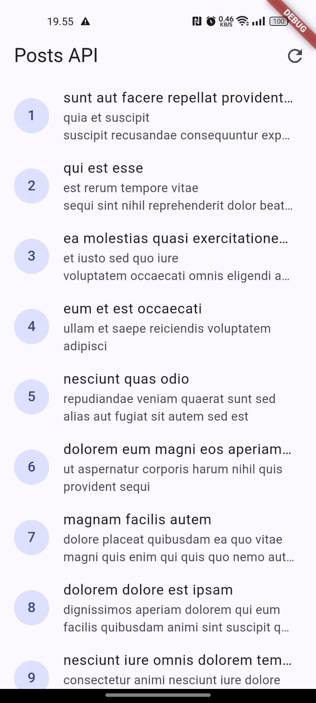

### Koneksi terputus

Ketika internet dimatikan, aplikasi menampilkan pesan error yang ramah dan
tombol **Coba lagi**.

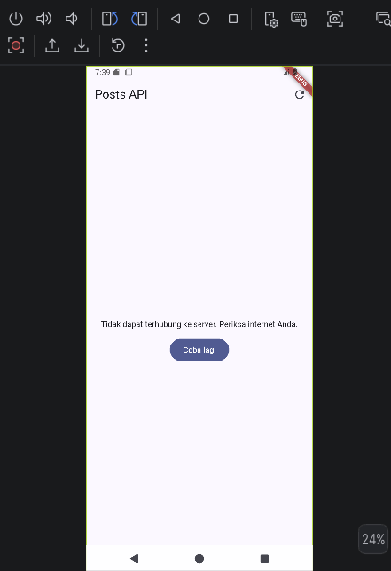

Setelah koneksi kembali, data dapat dimuat ulang.


### Error base URL

Pengujian dengan base URL yang salah menghasilkan pesan error koneksi.

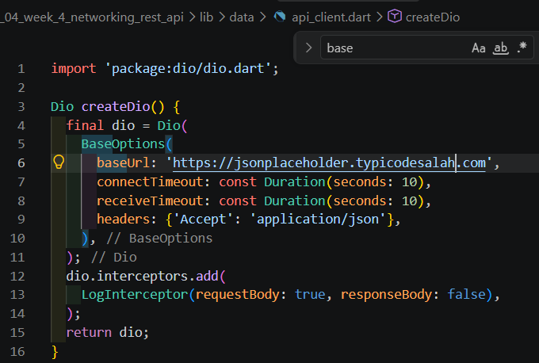

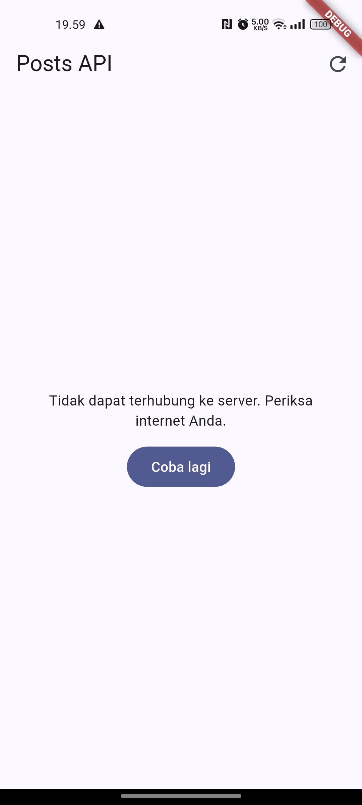

## Praktikum 3: Pagination

### Method pagination pada repository

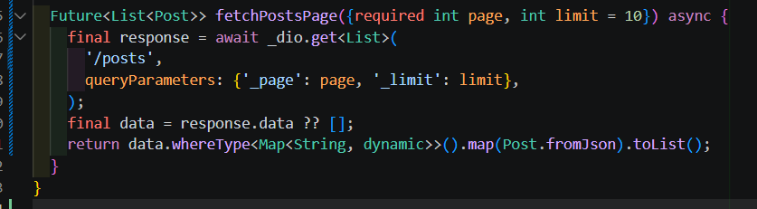

### Implementasi halaman pagination

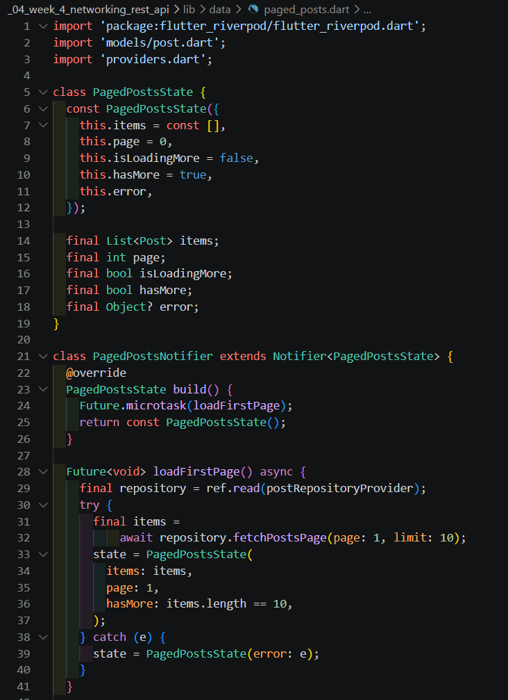

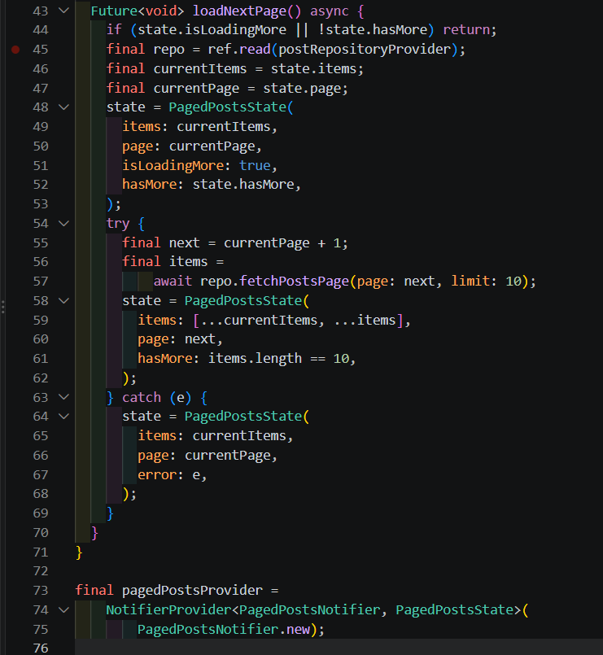

### Hasil pengujian

Pengujian dari HP:

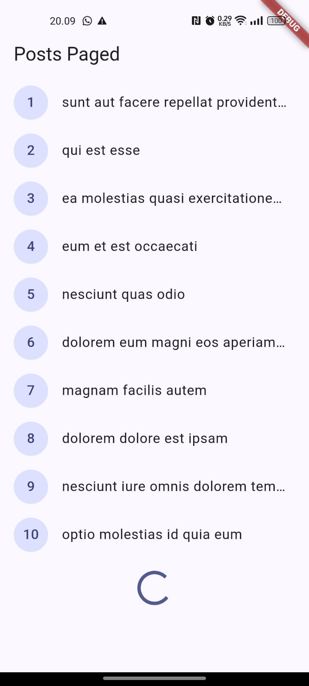

Pengujian dari Chrome:

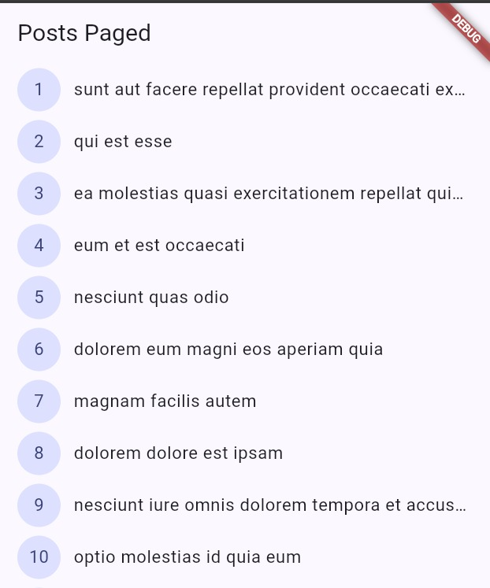

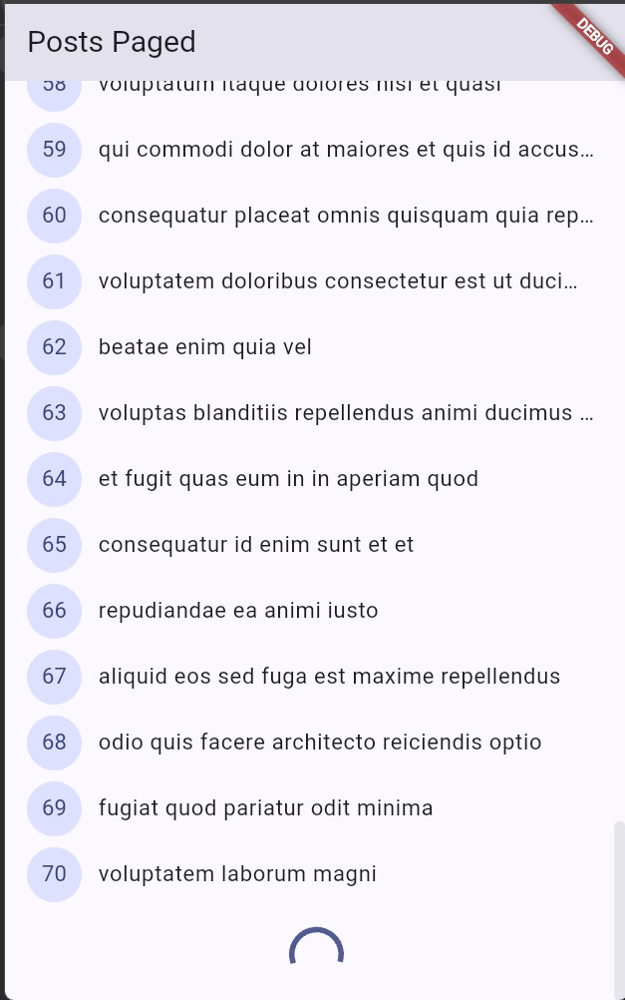

## AI Challenge

Implementasi repository komentar dari JSONPlaceholder:

- `lib/data/models/comment.dart`: model `Comment` dengan parsing aman terhadap
	field null atau hilang.
- `lib/data/repositories/comment_repository.dart`: method
	`fetchComments(postId)` untuk endpoint `GET /comments?postId={id}`.
- `lib/data/comment_providers.dart`: `AsyncNotifierProvider.family` dengan
	propagasi error menjadi `AsyncError`.

### AI Verification Checklist

- UI tidak memanggil Dio secara langsung. Akses data melewati provider dan
	repository.
- `Comment.fromJson` menggunakan fallback aman untuk `postId`, `id`, `name`,
	`email`, dan `body`.
- Timeout, `connectionError`, response 404, dan response 500 dipetakan ke
	pesan yang ramah pengguna.
- `baseUrl` dan timeout 10 detik terpusat di `lib/data/api_client.dart`.
- Test mencakup field yang hilang dan edge case konversi ID numerik.
- `flutter analyze`: **No issues found!**
- `flutter test`: **All tests passed!**

### Hasil AI Challenge

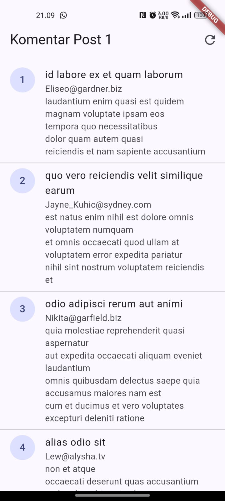

## Refactoring dan Testing

Dokumentasi lengkap tersedia di
[`docs/refactoring-testing.md`](docs/refactoring-testing.md).

Perubahan utama:

- `PostTile` reusable untuk list post dan pagination.
- `friendlyErrorMessage` dipusatkan di `lib/data/network_errors.dart`.
- GoRouter dengan route detail `/post/:id`.
- Detail post mengambil data dari list yang sudah dimuat atau repository jika
	dibuka langsung.
- Unit test model, mapping error, provider sukses, dan provider error memakai
	fake repository tanpa internet.

### Hasil Refactoring

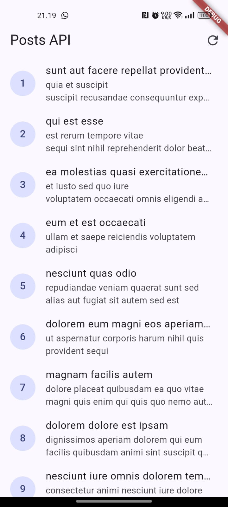

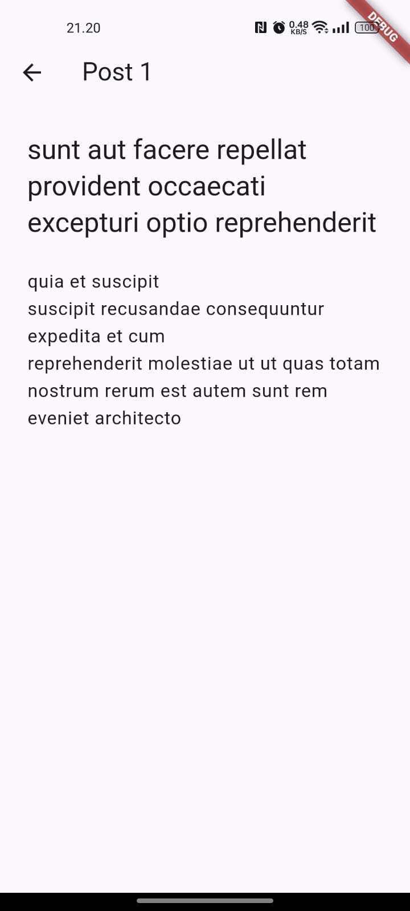

## Menjalankan Project

Jalankan perintah berikut dari folder project:

```bash
flutter pub get
flutter run
```

Untuk memeriksa kualitas kode dan menjalankan seluruh test:

```bash
flutter analyze
flutter test
```