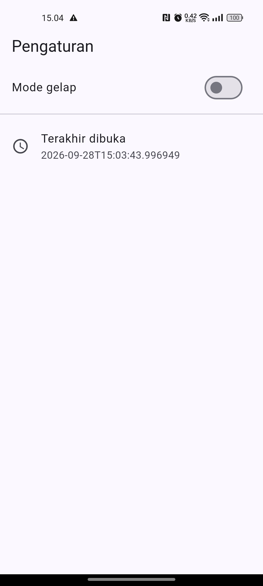
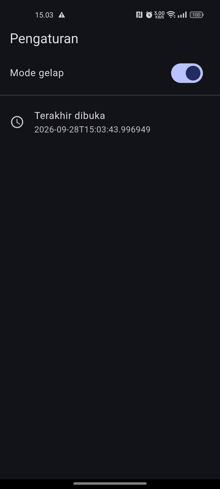

# Week 5: Local Storage & Offline First

## Identitas

| Keterangan | Detail |
| --- | --- |
| Nama | Muhammad Zuhdi Yudadharma |
| NIM | 244107020017 |
| Kelas | TI-3H |

# Praktikum 1 SharedPreferences

## Hasil Praktikum

1. light mode 
 
2. dark mode 
 
Halaman Settings menampilkan toggle Mode Gelap dan waktu terakhir aplikasi dibuka.

# Praktikum 2 SQLite dan Repository Catatan

## Hasil Praktikum

1. kondisi awal masih kosong 
 
2. menambahkan catatan, catatan akan muncul setelah mengisi 
 
3. setelah simpan, catatan tersimpan di halaman notes 
 

Halaman di atas menampilkan hasil Praktikum 2 berupa aplikasi catatan offline dengan penyimpanan SQLite.

# Praktikum 3 Cache-first dan Antrean Sync

## Hasil Praktikum
1. Catatan tersimpan secara lokal dan masih menunggu sinkronisasi. Ikon `cloud_off` menunjukkan catatan berstatus `dirty`, sedangkan banner menunjukkan jumlah antrean sync.
 
2. Setelah tombol **SYNC** ditekan, antrean diproses dan status catatan berubah menjadi tersinkron. Ikon berubah menjadi `cloud_done` dan banner antrean hilang.

Alur cache-first membaca catatan dari SQLite lokal terlebih dahulu, sehingga data tetap dapat ditampilkan secara offline. Perubahan baru diberi status `dirty` dan dimasukkan ke antrean, kemudian tombol **SYNC** memproses antrean tersebut.

# AI Challenge

## Hasil AI