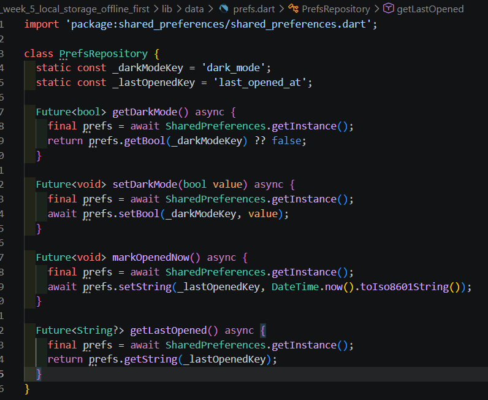
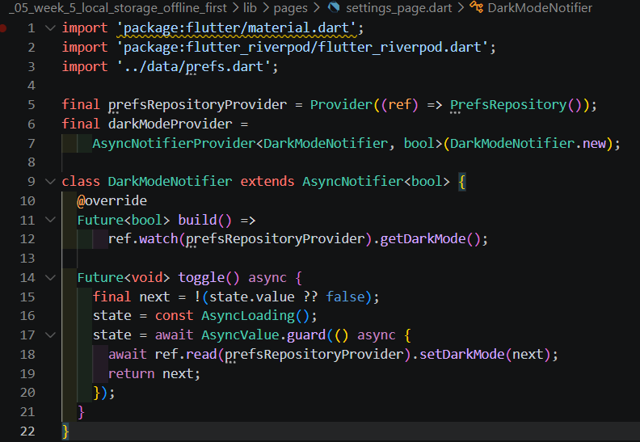
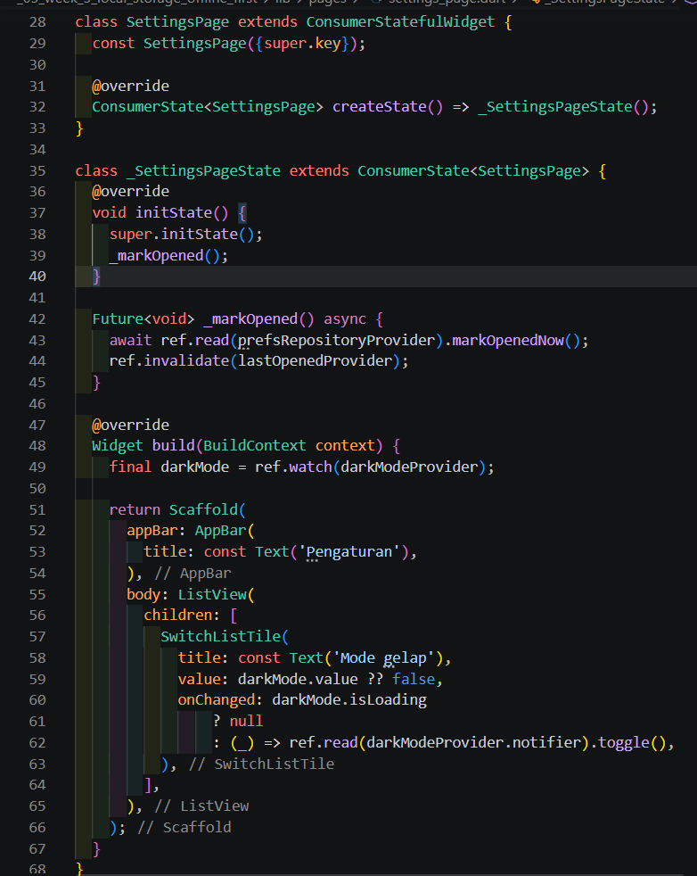
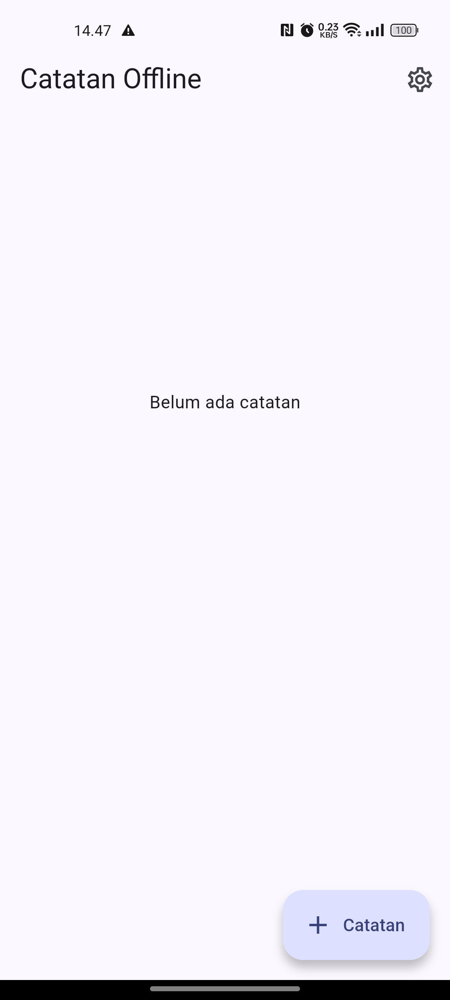

# Week 5: Local Storage & Offline First

## Identitas

| Keterangan | Detail |
| --- | --- |
| Nama | Muhammad Zuhdi Yudadharma |
| NIM | 244107020017 |
| Kelas | TI-3H |

# Praktikum 1 SharedPreferences

1. code Repository preferensi<br>
<br>

2. code Provider dan halaman pengaturan<br>
<br>
<br>

3. Hasil di Android<br>


# Praktikum 2 SQLite dan Repository Catatan

## Langkah 1: Membuat database SQLite

File [lib/data/local/db.dart](lib/data/local/db.dart) membuka database `offline_notes.db` dan membuat tabel `notes`.

```dart
Future<Database> openNotesDb() async {
	final dir = await getDatabasesPath();
	return openDatabase(
		p.join(dir, 'offline_notes.db'),
		version: 1,
		onCreate: (db, version) async {
			await db.execute('''
				CREATE TABLE notes(
					id INTEGER PRIMARY KEY AUTOINCREMENT,
					title TEXT NOT NULL,
					body TEXT NOT NULL DEFAULT '',
					updated_at TEXT NOT NULL,
					dirty INTEGER NOT NULL DEFAULT 0
				)
			''');
		},
	);
}
```

## Langkah 2: Membuat model Note

File [lib/data/local/note.dart](lib/data/local/note.dart) menjadi model dan konverter data antara object Dart dan row SQLite.

```dart
class Note {
	const Note({
		this.id,
		required this.title,
		this.body = '',
		required this.updatedAt,
		this.dirty = false,
	});

	final int? id;
	final String title;
	final String body;
	final DateTime updatedAt;
	final bool dirty;

	Map<String, Object?> toMap() => {
				'id': id,
				'title': title,
				'body': body,
				'updated_at': updatedAt.toIso8601String(),
				'dirty': dirty ? 1 : 0,
			};
}
```

## Langkah 3: Membuat repository catatan

File [lib/data/repositories/note_repository.dart](lib/data/repositories/note_repository.dart) memusatkan operasi database. UI tidak mengakses SQLite secara langsung.

```dart
class NoteRepository {
	NoteRepository({Future<Database> Function()? openDb})
			: _openDb = openDb ?? openNotesDb;

	final Future<Database> Function() _openDb;

	Future<List<Note>> fetchNotes() async {
		final db = await _openDb();
		final rows = await db.query('notes', orderBy: 'updated_at DESC');
		return rows.map(Note.fromMap).toList();
	}

	Future<Note> addNote({required String title, String body = ''}) async {
		final db = await _openDb();
		final note = Note(
			title: title,
			body: body,
			updatedAt: DateTime.now(),
			dirty: true,
		);
		final id = await db.insert('notes', note.toMap());
		return Note(
			id: id,
			title: note.title,
			body: note.body,
			updatedAt: note.updatedAt,
			dirty: true,
		);
	}

	Future<void> deleteNote(int id) async {
		final db = await _openDb();
		await db.delete('notes', where: 'id = ?', whereArgs: [id]);
	}
}
```

## Langkah 4: Menghubungkan repository ke Riverpod

Pada [lib/pages/notes_page.dart](lib/pages/notes_page.dart), repository didaftarkan sebagai provider dan `NotesNotifier` mengelola state daftar catatan.

```dart
final noteRepositoryProvider = Provider((ref) => NoteRepository());
final notesProvider =
		AsyncNotifierProvider<NotesNotifier, List<Note>>(NotesNotifier.new);

class NotesNotifier extends AsyncNotifier<List<Note>> {
	@override
	Future<List<Note>> build() {
		return ref.read(noteRepositoryProvider).fetchNotes();
	}

	Future<void> addNote({required String title, String body = ''}) async {
		state = const AsyncLoading();
		state = await AsyncValue.guard(() async {
			await ref.read(noteRepositoryProvider).addNote(title: title, body: body);
			return ref.read(noteRepositoryProvider).fetchNotes();
		});
	}
}
```

## Langkah 5: Membuat tampilan catatan

`NotesPage` menampilkan data SQLite, menyediakan tombol tambah catatan, menghapus catatan, dan refresh data lokal. Tombol Settings tetap tersedia untuk menguji hasil Praktikum 1.

```dart
return Scaffold(
	appBar: AppBar(
		title: const Text('Catatan Offline'),
	),
	body: notes.when(
		loading: () => const Center(child: CircularProgressIndicator()),
		error: (error, _) => Center(child: Text('Gagal memuat catatan: $error')),
		data: (items) => ListView.builder(
			itemCount: items.length,
			itemBuilder: (context, index) {
				final note = items[index];
				return ListTile(
					title: Text(note.title),
					subtitle: Text(note.body),
					trailing: IconButton(
						icon: const Icon(Icons.delete_outline),
						onPressed: () => ref
								.read(notesProvider.notifier)
								.deleteNote(note.id!),
					),
				);
			},
		),
	),
	floatingActionButton: FloatingActionButton.extended(
		onPressed: () => _showAddNoteDialog(context, ref),
		icon: const Icon(Icons.add),
		label: const Text('Catatan'),
	),
);
```

## Screenshot hasil Praktikum 2



Screenshot tersebut menunjukkan halaman `Catatan Offline` yang menjadi halaman utama aplikasi. Catatan baru dapat ditambahkan melalui tombol **Catatan**, lalu disimpan ke database SQLite lokal.

## Pengujian

1. Jalankan aplikasi pada perangkat Android.
2. Tekan tombol **Catatan**.
3. Isi judul dan isi catatan, lalu tekan **Simpan**.
4. Pastikan catatan muncul pada daftar.
5. Tutup dan jalankan kembali aplikasi untuk memastikan data tetap tersimpan.
6. Tekan ikon hapus untuk menghapus catatan.

Perintah validasi yang digunakan:

```bash
flutter analyze
flutter build apk
```

Hasil validasi: `No issues found!` dan APK berhasil dibuat pada `build/app/outputs/flutter-apk/app-release.apk`.

# Praktikum 2 SQLite dan repository catatan

1. 