# Week 6: Authentication, Security & FCM

Project Flutter untuk mempelajari autentikasi, penyimpanan token yang aman, dan
Firebase Cloud Messaging (FCM). Fokus utama: login dengan penyimpanan token di
secure storage, token refresh otomatis, serta penanganan notifikasi FCM pada
tiga app state.

## Identitas

| Keterangan | Detail |
| --- | --- |
| Nama | Muhammad Zuhdi Yudadharma |
| NIM | 244107020017 |
| Kelas | TI-3H |

## Teknologi

- Flutter
- Flutter Riverpod
- GoRouter
- Dio
- flutter_secure_storage
- firebase_core, firebase_messaging
- flutter_local_notifications

---

# Praktikum 1: Login, Secure Storage, dan Token Refresh

## Penyimpanan token yang aman

```dart
class TokenStore {
  TokenStore({FlutterSecureStorage? storage})
      : _storage = storage ?? const FlutterSecureStorage();

  final FlutterSecureStorage _storage;
  static const _accessKey = 'access_token';
  static const _refreshKey = 'refresh_token';

  Future<void> save({required String access, required String refresh}) async {
    await _storage.write(key: _accessKey, value: access);
    await _storage.write(key: _refreshKey, value: refresh);
  }

  Future<String?> readAccess() => _storage.read(key: _accessKey);
  Future<String?> readRefresh() => _storage.read(key: _refreshKey);

  Future<void> clear() => _storage.deleteAll();
}
```

## Refresh otomatis dengan Dio

`lib/data/api_client.dart` menambahkan interceptor yang:

1. Menyisipkan header `Authorization: Bearer <access>` pada setiap request.
2. Saat menerima `401`, menukar refresh token menjadi access token baru,
   menyimpannya kembali ke secure storage, lalu mengulang request sekali.
3. Jika refresh ikut kedaluwarsa, membersihkan sesi (`clear()`) sehingga
   pengguna dipaksa login ulang.

## Hasil Praktikum

### Halaman Login

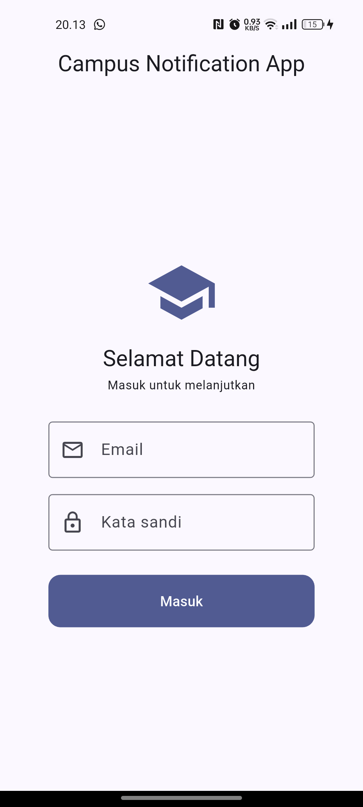

### Validasi form

Email tanpa `@` atau kata sandi kurang dari 6 karakter ditolak sebelum request
dikirim.

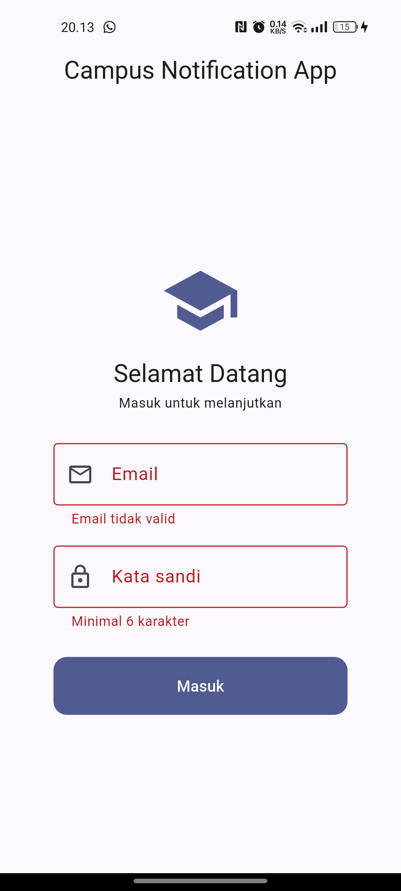

### Halaman Beranda setelah login

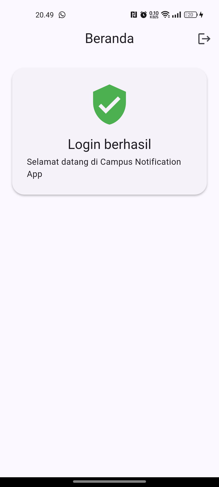

---

# Praktikum 2: FCM, Permission, dan Token Lifecycle

## Inisialisasi Firebase

`Firebase.initializeApp()` dipanggil di `main()` sebelum `runApp`, kemudian
service FCM dijalankan:

```dart
void main() async {
  WidgetsFlutterBinding.ensureInitialized();
  await Firebase.initializeApp();

  await initLocalNotifications();
  await requestNotificationPermission();

  final dio = container.read(apiClientProvider);
  await initFcmToken(onToken: (token) async {
    // kirim token ke backend (POST /devices)
  });

  runApp(...);
}
```

## Permission notifikasi

Izin `POST_NOTIFICATIONS` ditambahkan di `AndroidManifest.xml`, lalu dialog
runtime diminta lewat `requestPermission()`.

## Token lifecycle

```dart
Future<void> initFcmToken({required Future<void> Function(String token) onToken}) async {
  // 1. Ambil token saat ini dan kirim ke backend.
  final token = await FirebaseMessaging.instance.getToken();
  if (token != null) await onToken(token);

  // 2. Token bisa berubah (reinstall, clear data, rotasi keamanan).
  //    Listener ini WAJIB ada, jika tidak backend menyimpan token basi.
  FirebaseMessaging.instance.onTokenRefresh.listen(onToken);

  // 3. Langganan topik kampus.
  await FirebaseMessaging.instance.subscribeToTopic('pengumuman-kampus');
}
```

## Hasil Praktikum

### Dialog izin notifikasi

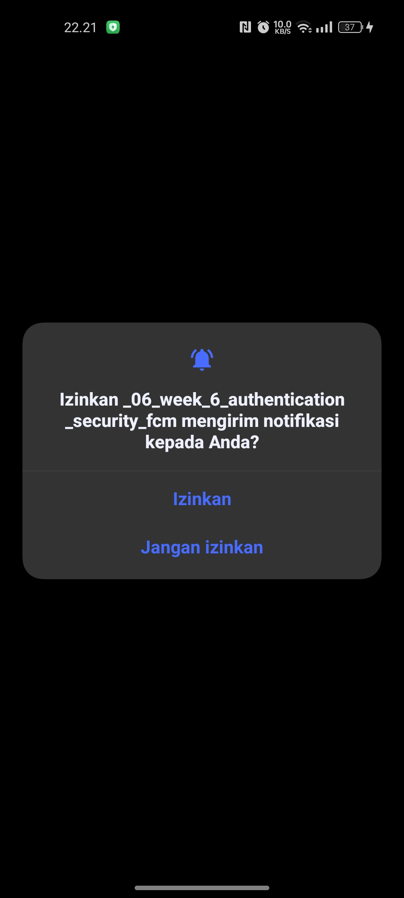

### Token FCM tampil terpotong

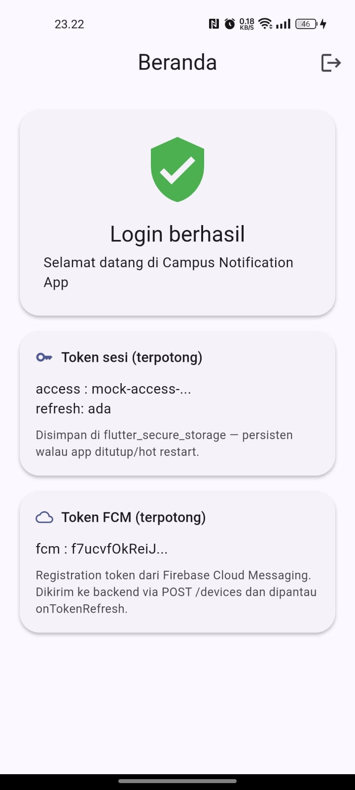

### Pengiriman token ke backend (POST /devices)

Pengiriman ke `example-campus-api.test` menghasilkan `connectionError` karena
backend memang belum tersedia — hal ini didokumentasikan, sesuai codelab.

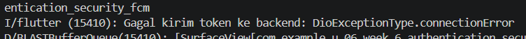

### Notifikasi tes dari Firebase Console

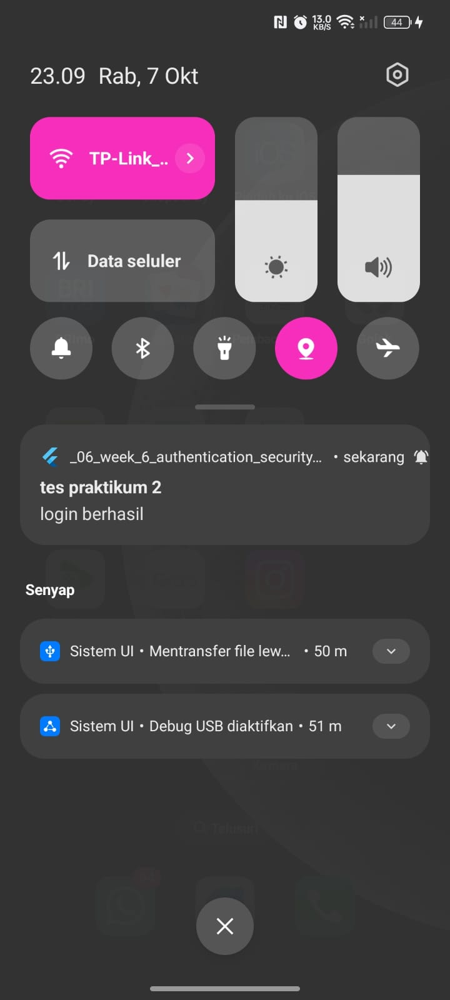

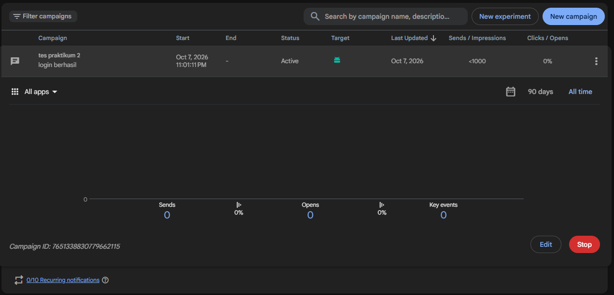

### Token refresh setelah clear data

- token lama: `cB8ZfbSKQLmr...`
- token baru: `f7ucvfOkReiJ...`

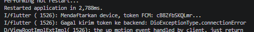

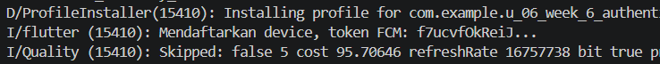

---

# Praktikum 3: Tiga App State dan Deep Link

## Background handler (top-level)

```dart
@pragma('vm:entry-point')
Future<void> firebaseMessagingBackgroundHandler(RemoteMessage message) async {
  // Jangan akses BuildContext / Riverpod di sini.
  debugPrint('[FCM background] id=${message.messageId} '
      'route=${message.data['route']}');
}

void registerBackgroundHandler() {
  FirebaseMessaging.onBackgroundMessage(firebaseMessagingBackgroundHandler);
}
```

## Tiga handler app state

```dart
void listenForeground(void Function(String route) go) {
  // Foreground: sistem TIDAK menampilkan banner otomatis,
  // jadi tampilkan manual via local notification.
  FirebaseMessaging.onMessage.listen((message) async {
    final route = routeFromMessage(message.data);
    const androidDetails = AndroidNotificationDetails(
      'pengumuman', 'Pengumuman Kampus',
      importance: Importance.high, priority: Priority.high,
    );
    await _local.show(
      id: message.hashCode,
      title: message.notification?.title ?? 'Pengumuman',
      body: message.notification?.body ?? '',
      notificationDetails: const NotificationDetails(android: androidDetails),
      payload: route,
    );
  });

  // Background -> diklik.
  FirebaseMessaging.onMessageOpenedApp.listen((message) {
    go(routeFromMessage(message.data));
  });
}

Future<void> handleTerminated(void Function(String route) go) async {
  final initial = await FirebaseMessaging.instance.getInitialMessage();
  if (initial != null) go(routeFromMessage(initial.data));
  if (pendingDeepLink != null) go(pendingDeepLink!);
}
```

## Payload uji (notification + data)

```json
{
  "message": {
    "topic": "pengumuman-kampus",
    "notification": {
      "title": "Jadwal kuliah berubah",
      "body": "Kelas Mobile pindah ke Ruang A2 jam 13.00"
    },
    "data": {
      "route": "/pengumuman/3",
      "id": "3"
    }
  }
}
```

## Topic messaging

```dart
await FirebaseMessaging.instance.subscribeToTopic('pengumuman-kampus');
await FirebaseMessaging.instance.unsubscribeFromTopic('pengumuman-kampus');
```

Aturan: topik untuk broadcast (semua mahasiswa / satu kelas), token perangkat
untuk pesan personal (nilai, tagihan).

## Hasil Praktikum

### State Foreground

Banner ditampilkan manual lewat `flutter_local_notifications` pada `onMessage`.

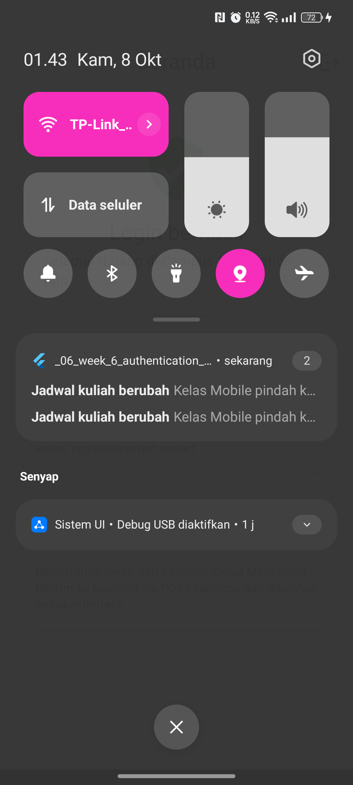

Klik banner menavigasi ke `data.route` (`/pengumuman/3`):

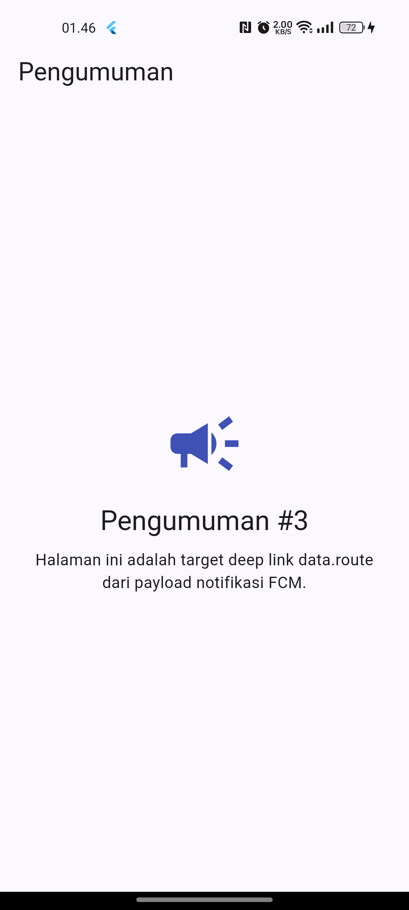

### State Background

Banner sistem muncul otomatis, lalu klik memicu `onMessageOpenedApp`.

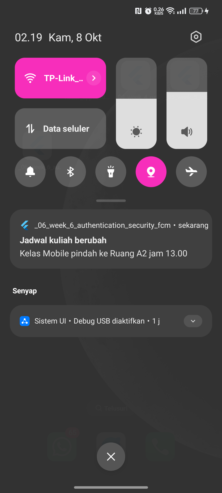

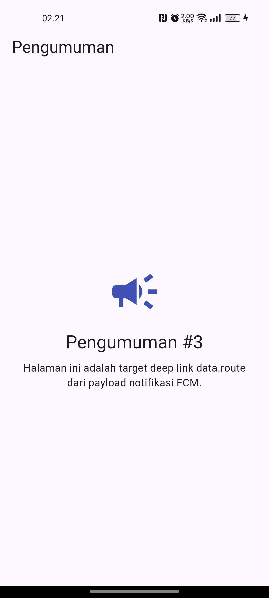

### Log handler

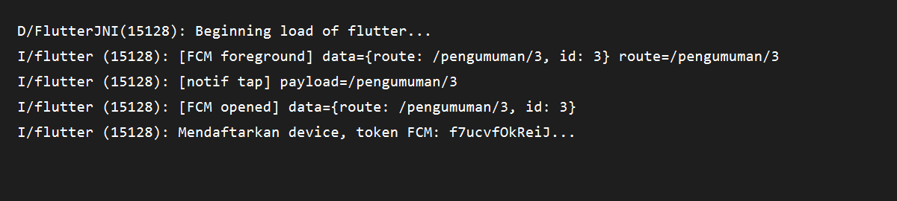

### Tabel pengujian tiga app state

| State | Yang diharapkan | Hasil |
| --- | --- | --- |
| Foreground | Banner lokal muncul, klik masuk `/pengumuman/3` | Berhasil |
| Background | Banner sistem muncul, klik masuk `/pengumuman/3` | Berhasil |
| Terminated | Aplikasi terbuka ke `/pengumuman/3` via `getInitialMessage` | Tidak teruji (batasan OEM) |

> Catatan: pada perangkat OPPO/ColorOS, sistem membekukan aplikasi secara
> agresif saat aplikasi ditutup, sehingga notifikasi FCM tidak dikirimkan ke
> aplikasi dalam state terminated. Perilaku ini merupakan kebijakan manajemen
> baterai OEM, bukan kesalahan kode.

---

# AI Challenge

Dokumentasi prompt, output awal AI, daftar perbaikan manual, alasan teknis,
dan tabel hasil uji tiga app state tersedia di
[docs/ai-challenge.md](docs/ai-challenge.md).

Ringkasan verifikasi draf AI:

- Background handler berupa fungsi top-level dengan `@pragma('vm:entry-point')`.
- `onTokenRefresh` benar-benar mengirim token baru ke backend (`POST /devices`),
  bukan sekadar log.
- Foreground memakai local notification manual (`onMessage` + `_local.show`).
- Klik dari state foreground & background masuk ke `/pengumuman/3`.
- Token tidak di-hardcode dan hanya ditampilkan terpotong.
- Kredensial backend (`service-account.json`) tidak di-commit.

---

# Refactoring dan Testing

Refactoring yang dilakukan:

1. **Konstanta rute** dipusatkan di `lib/routes.dart` (`AppRoutes`) agar deep
   link FCM dan GoRouter memakai sumber yang sama.
2. **Parsing `RemoteMessage -> route`** diekstrak menjadi fungsi murni
   `routeFromMessage(Map<String, dynamic> data)` sehingga dapat diunit-test
   tanpa Firebase.
3. **Pemetaan `DioException -> pesan ramah pengguna`** dipindah ke
   `lib/data/api_errors.dart` (`friendlyErrorMessage`).

Hasil validasi:

```text
flutter analyze : No issues found!
flutter test    : 9 tests passed
```
---

# Struktur Project

```text
lib/
├── main.dart                     # init Firebase, guard route, deep link handler
├── routes.dart                   # konstanta rute (Refactoring #1)
├── data/
│   ├── token_store.dart          # penyimpanan token di secure storage
│   ├── auth_repository.dart      # mock login & refresh
│   ├── api_client.dart           # Dio + interceptor refresh 401
│   └── api_errors.dart           # pemetaan error ramah pengguna (Refactoring #3)
├── messaging/
│   └── push_service.dart         # permission, token lifecycle, 3 state, routeFromMessage
├── providers/
│   └── auth_provider.dart        # provider auth + token store + Dio
└── pages/
    ├── login_page.dart
    ├── home_page.dart
    └── announcement_page.dart    # target deep link /pengumuman/:id
```

---

# Cara Menjalankan

```bash
flutter pub get
flutter run
```

Memeriksa kualitas kode:

```bash
flutter analyze
flutter test
```

> **Catatan (Windows):** bila path project mengandung spasi (mis.
> `D:\Semester 5\...`), build APK dapat gagal pada proses native assets.
> Jalankan dari drive virtual tanpa spasi:
>
> ```cmd
> subst M: "D:\Semester 5\244107020017-mobile-course"
> M:
> cd \_06_week_6_authentication_security_fcm
> flutter run
> ```
